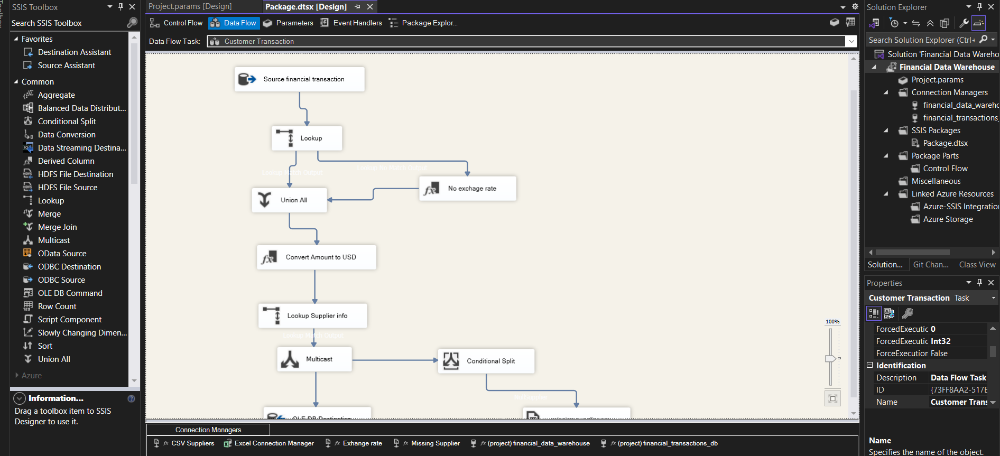
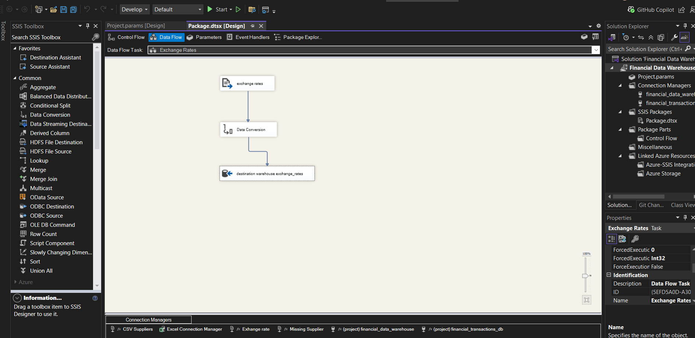
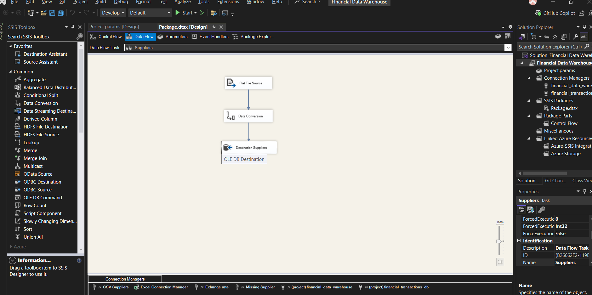

# ETL using SSIS and SQL 🚀

## 📌 Project Overview
This repository contains my **SQL Server Integration Services (SSIS)** project, demonstrating **ETL (Extract, Transform, Load)** processes.  
The solution highlights best practices in **data integration, transformation, and automation** using SSIS.  

🔗 Reference Video Tutorial: [ETL SSIS Channel](https://www.youtube.com/watch?v=qmSsZhaFcZw&t=4521s)

---

## 🔑 Key Features
- **Data Extraction**: Importing raw data from SQL Server, CSV, and Excel files.  
- **Data Transformation**: Cleaning, deduplicating, lookups, derived columns, and business rules.  
- **Data Loading**: Writing processed data into staging and warehouse layers.  
- **Error Handling**: Configured error outputs for data quality monitoring.  
- **Automation**: Deployment and scheduling via SQL Server Agent.  

---

## 🛠️ Tech Stack
- **SQL Server** → Source & destination databases  
- **SSIS (SQL Server Integration Services)** → ETL orchestration  
- **SQL** → Data preparation, validation, and transformations  

---

## 🗂️ Project Architecture
The following images show **SSIS Dataflows** and their transformation logic:  

### 🔹 Dataflow 1
  

### 🔹 Dataflow 2
  

### 🔹 Dataflow 3
  

---

## 📊 SQL Setup

### 1. Create Database and Transactions Table
```sql
CREATE DATABASE financial_transactions_db;	

USE financial_transactions_db;

CREATE TABLE financial_transactions (
    transaction_id INT PRIMARY KEY,
    customer_id INT,
    supplier_name VARCHAR(50),
    transaction_date DATE,
    amount DECIMAL(10, 2),
    currency VARCHAR(10)
);

INSERT INTO financial_transactions (transaction_id, customer_id, supplier_name, transaction_date, amount, currency)
VALUES
    (1, 101, 'ABC Corp', '2024-01-15', 1000.00, 'USD'),
    (2, 102, 'XYZ Ltd', '2024-01-20', 1500.50, 'EUR'),
    (3, 103, 'Global Inc', '2024-02-05', 2000.00, 'GBP'),
    (4, 104, 'ABC Corp', '2024-02-10', 500.25, 'USD');
```

### 2. Excel File Setup (exchange_rates.xlsx)
- **Sheet Name**: `Rates`  
- **Columns**: from_currency, to_currency, exchange_rate, effective_date  
```plaintext
from_currency    to_currency    exchange_rate    effective_date
USD              USD            1.00             2024-01-01
EUR              USD            0.89             2024-01-01
GBP              USD            1.30             2024-01-01
```

### 3. CSV File Setup (suppliers.csv)
```plaintext
supplier_id,supplier_name,contact_name,phone
201,ABC Corp,Alice Brown,567-890-1234
202,XYZ Ltd,Bob White,678-901-2345
203,Global Inc,Carol Green,789-012-3456
```

---

## ⚙️ SSIS Implementation Steps

### 1. Setup in Visual Studio
- Install the **SSIS extension**.  
- Create a new SSIS project.  
- Add a **Data Flow Task (DFT)**.  
- Add an **OLE DB Source** connection:  
  - Provider: MS OLE DB Driver  
  - Server: `LAPTOP-J5Q13GJJ\SQLEXPRESS`  
  - Database: `financial_transactions_db`  

### 2. Create Data Warehouse
```sql
CREATE DATABASE financial_data_warehouse;
USE financial_data_warehouse;

CREATE TABLE financial_analysis (
    transaction_id INT PRIMARY KEY,
    customer_name VARCHAR(50),
    supplier_name VARCHAR(50),
    transaction_date DATE,
    amount_usd DECIMAL(10, 2),
    supplier_phone VARCHAR(20)
);
```

### 3. OLE DB Destination Setup
- Connect to `financial_data_warehouse`.  
- Use SQL join in source to merge customers and transactions:  
```sql
SELECT t.*, c.customer_name, c.email, c.phone
FROM dbo.customer_details c
INNER JOIN dbo.financial_transactions t 
ON c.customer_id = t.customer_id;
```

### 4. Supporting Tables
```sql
CREATE TABLE [dbo].[exhange_rates](
    from_currency varchar(10),
    to_currency varchar(10),
    exhange_rate float,
    effective_date date
);

CREATE TABLE [dbo].[suppliers](
    supplier_id int,
    supplier_name varchar(100),
    contact_name varchar(100),
    phone varchar(25)
);
```

### 5. Table Alterations and Updates
```sql
ALTER TABLE [dbo].[financial_transactions]
ADD amount_USD float,
    customer_email varchar(50) NULL;

UPDATE [dbo].[financial_transactions]
SET currency = 'USDX'
WHERE transaction_id = 4;

INSERT INTO financial_transactions (transaction_id, customer_id, supplier_name, transaction_date, amount, currency)
VALUES (5, 105, 'xyx corp', '2024-01-15', 11000.00, 'UST');
```

---

## 🔄 SSIS Transformations
- **Lookup Activity** → Fetch exchange rates based on currency.  
- **Derived Column** → Apply default values where lookups fail.  
- **Union All** → Consolidate datasets.  
- **Data Conversion** → Ensure correct data types.  
- **Multicast** → Route data to multiple outputs (e.g., flat file + DB).  
- **Conditional Split** → Filter data flows.  

---

## 🚀 Deployment
1. Parameterize all connections.  
2. Right-click project → Deploy.  
3. Ensure `SSISDB` catalog exists.  
4. Deploy package to SQL Server catalog.  

### Enterprise Setup (in SSISDB)
- Create an **Environment** (e.g., `Dev`).  
- Add **variables** like `SupplierConnectionString`.  
- Reference the project to environment.  
- Configure parameters with environment variables.  

### Scheduling via SQL Server Agent
- Create a new job (`Finance Data Warehouse`).  
- Add a step: Run SSIS package.  
- Configure to use environment.  
- Add schedule: **Daily Refresh**.  

---

## 🌐 SSIS + API Integration
- Copy existing SSIS package.  
- Use **Script Component Activity (Source)** for API extraction.  
- Add output columns and set data types.  
- Insert custom script for API calls:  
  🔗 [ExchangeRateScriptComponent.cs](https://github.com/EmbarkBlue/JoeyBlue-SQL-Trainings/blob/main/Youtube/SSIS/files/ExchangeRateScriptComponent.cs)  
- Apply **Derived Columns** and transformations.  
- Load into SQL Server via **OLE DB Destination**.  

---

## 🎯 Learning Outcomes
- Build **SSIS packages** for ETL workflows.  
- Design **Dataflows** with transformations.  
- Use **SQL + SSIS** for scalable pipelines.  
- Implement **scheduling & deployment** strategies.  
